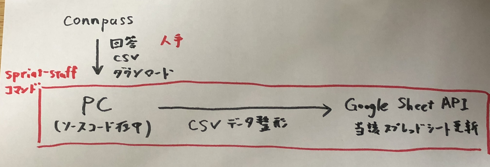

# 繰り返すPyCon JPスタッフタスクはPythonにやらせよう

スプリントのテーマ一覧シートの更新をPythonにやらせます。

## 前提

9/14開催、PyCon JP 2019 Sprint（参加費無料）  
https://pyconjp.connpass.com/event/136558/

参加形態は2つ：「参加者」と「リーダー」  

- リーダーはスプリントで取り組みたいテーマを持った人
- 参加者は当日参加するプロジェクトを選ぶ（会場で作ったチームで開発していく）

タスク：リーダーが申込時に回答したテーマを、事前に参加者に公開する
（プロジェクト選びやスプリントへの参加の検討の一助となることを期待）。

リーダーが回答したテーマをGoogleスプレッドシートにて一覧にする。  
申込みは増加するので、スプレッドシートの内容を更新する必要がある。  
→スプレッドシートの更新は**人手ではやらず、Pythonスクリプトに任せることにする**。

## アーキテクチャ



## 導入方法

### ソースコードの動作環境構築

macOSを想定しています

```
$ git clone https://github.com/ftnext/pyconjp2019.sprint.theme.update.git
$ cd pyconjp2019.sprint.theme.update
$ python3 -m venv env
$ . env/bin/activate
(env)$ pip install .
```

### Google スプレッドシートまわり

- スプレッドシートのAPIへのアクセスに「サービスアカウントキー」の入手が必要です。
    - 参考：https://google-auth.readthedocs.io/en/latest/user-guide.html
- プログラムから当該スプレッドシートへアクセスするために、サービスアカウントキーのユーザに編集権限を付ける必要がありました

## スプレッドシート更新

前提：connpassからダウンロードした参加者情報CSVをfilesディレクトリ下に配置している  
（filesはsprinttaskautoやtestsと同じ階層に作る）

```
(env)$ sprint-staff
```
